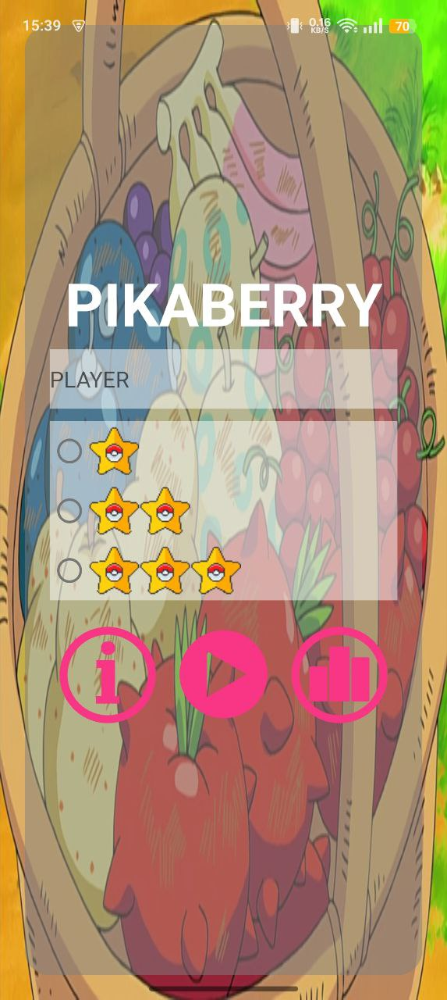
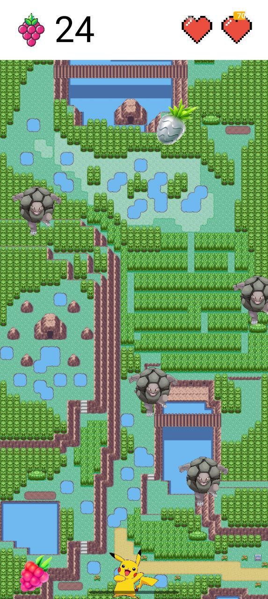
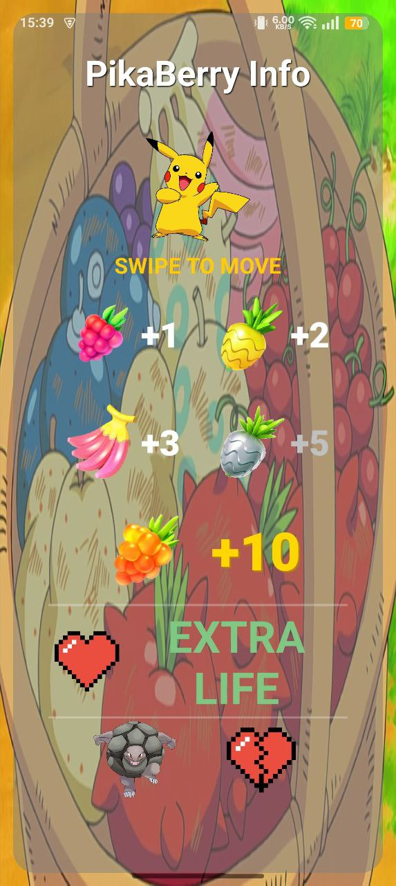

# PikaBerry ⚡🍓

**PikaBerry** is a fast-paced arcade game for Android. Take control of Pikachu, collect as many berries as possible, and survive the Golem avalanche!

---

## 📸 Screenshots

|           Menu            |           Gameplay            |               Info                |
|:-------------------------:|:-----------------------------:|:---------------------------------:|
|  |  |  |

---

## 🎮 Gameplay

The mechanics are simple but challenging:

* **Move:** Control Pikachu along the horizontal axis at the bottom of the screen.
* **Collect:** Catch falling **Berries** to increase your score and stay energized.
* **Dodge:** Avoid the **Golems**. These heavy rock-type Pokémon fall from the sky and will take away your health on impact.
---

## 📥 Installation

Installing PikaBerry is easy. Since it's an open-source project, you can get it directly from this repository:

- Go to the [**Releases**](https://github.com/enseor/PikaBerry/releases) section of this repository.
---

## 🛠️ Technical Details

This project focuses on clean code and efficient 2D rendering:

* **Platform:** Native Android.
* **Architecture:** Developed using the **MVC (Model-View-Controller)** pattern. This ensures a clear separation between the game data (Models), the drawing logic (Views), and the user input handling (Controllers).
---

## License

This project is licensed under the [GNU General Public License v3.0](LICENSE).